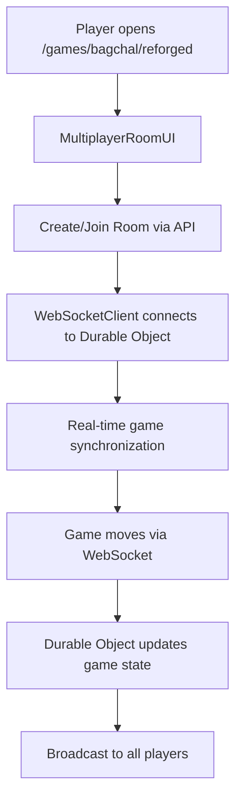

# 🏗️ Project Architecture

## 📁 Directory Structure

```
src/
├── core/                        # 🏗️ Core application infrastructure
│   ├── multiplayer/             # 🎮 Multiplayer functionality
│   │   ├── index.ts            # Clean exports
│   │   └── WebSocketClient.ts  # Real-time communication
│   ├── server/                  # ☁️ Server-side code
│   │   ├── index.ts            # Server exports
│   │   └── GameRoomDurableObject.ts  # Cloudflare Durable Object
│   ├── ai/                      # 🤖 AI and game engines
│   └── engine/                  # ⚙️ Core game engines
│
├── lib/                         # 📚 Reusable utilities
│   ├── components/              # 🧩 Reusable UI components
│   └── utils/                   # 🛠️ Utility functions
│
├── routes/                      # 🛣️ SvelteKit routes
│   ├── api/                     # API endpoints
│   │   └── rooms/               # Multiplayer room management
│   │       ├── +server.ts       # Create rooms
│   │       └── [roomCode]/      # Room-specific operations
│   │           ├── join/+server.ts      # Join room
│   │           ├── websocket/+server.ts # WebSocket URL
│   │           └── ws/+server.ts        # WebSocket upgrade
│   └── games/bagchal/           # Game routes
│       ├── +page.svelte         # Classic single-player
│       └── reforged/+page.svelte # Multiplayer mode
│
├── games/                       # 🎯 Game-specific code
│   └── bagchal/                 # Bagchal game
│       ├── ui/                  # Game UI components
│       │   └── MultiplayerRoomUI.svelte
│       ├── types/               # TypeScript definitions
│       │   └── multiplayer.ts   # Multiplayer types
│       ├── rules.ts             # Game logic
│       └── store.svelte.ts      # Game state
│
└── app.html                     # Main HTML template
```

## 🎯 Architecture Principles

### 1. **Clean Separation of Concerns**
- **`/core/multiplayer/`** - All real-time multiplayer functionality
- **`/core/server/`** - Server-side Cloudflare Workers code
- **`/core/ai/`** - AI engines and algorithms
- **`/games/bagchal/`** - Game-specific logic and UI
- **`/lib/`** - Reusable utilities and components
- **`/routes/api/`** - REST API endpoints

### 2. **Single Source of Truth**
- **One Durable Object**: `GameRoomDurableObject.ts` (TypeScript)
- **One WebSocket Client**: `WebSocketClient.ts`
- **Clean Exports**: Each module has an `index.ts` for organized imports

### 3. **Import Organization**
```typescript
// ✅ Clean imports using organized modules
import { WebSocketClient, type MultiplayerGameState } from '$core/multiplayer';

// ❌ Avoid scattered imports
import { WebSocketClient } from '$core/multiplayer/WebSocketClient';
import type { MultiplayerGameState } from '$games/bagchal/types/multiplayer';
```

## 🚀 Deployment Structure

### Cloudflare Workers
- **Main Worker**: `.svelte-kit/cloudflare/_worker.js` (auto-generated)
- **Durable Objects**: Exported from `src/core/server/GameRoomDurableObject.ts`
- **Configuration**: `wrangler.toml`

### Build Process
1. SvelteKit builds the application
2. Cloudflare adapter generates worker
3. Durable Objects are deployed alongside

## 🎮 Multiplayer Flow



## 📦 Key Components

### Core Infrastructure (`/core/`)
- **`multiplayer/WebSocketClient.ts`** - Handles real-time communication
- **`server/GameRoomDurableObject.ts`** - Manages game state and WebSocket connections
- **`ai/`** - AI engines and algorithms
- **`engine/`** - Core game engines

### Game-Specific (`/games/`)
- **`bagchal/ui/MultiplayerRoomUI.svelte`** - Room creation/joining interface
- **`bagchal/reforged/+page.svelte`** - Multiplayer game page
- **`bagchal/types/multiplayer.ts`** - Game-specific type definitions

### API Layer (`/routes/api/`)
- **`/api/rooms/*`** - REST endpoints for room management
- **D1 Database** - Persistent room storage

### Utilities (`/lib/`)
- **`components/`** - Reusable UI components
- **`utils/`** - Shared utility functions

This architecture ensures:
- 🧹 **Clean organization** - Logical separation by purpose
- 🔄 **Easy maintenance** - Clear separation of concerns  
- 📈 **Scalability** - Core infrastructure separate from game logic
- 🎯 **Developer experience** - Intuitive imports and structure
- 🎮 **Game modularity** - Easy to add new games without affecting core 